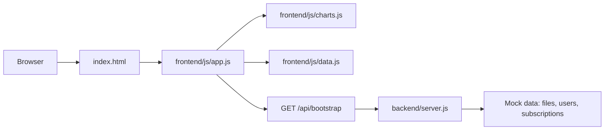
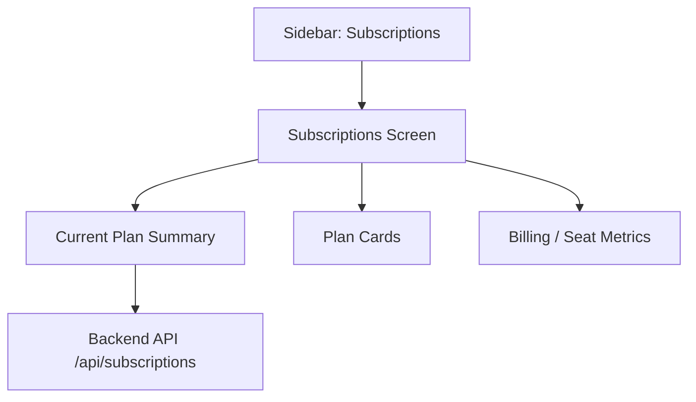

# SecureShare Architecture

This project is now split so the app layers are easy to find:

- `frontend/` contains the UI.
- `backend/` contains the mock server and API routes.
- `docs/diagrams/` contains architecture notes and diagrams.

## Folder Map

```text
New project/
|-- index.html
|-- frontend/
|   |-- css/styles.css
|   `-- js/
|       |-- app.js
|       |-- charts.js
|       `-- data.js
|-- backend/
|   `-- server.js
`-- docs/
    `-- diagrams/
        `-- architecture.md
```

## Data Flow



## Subscription Placement


